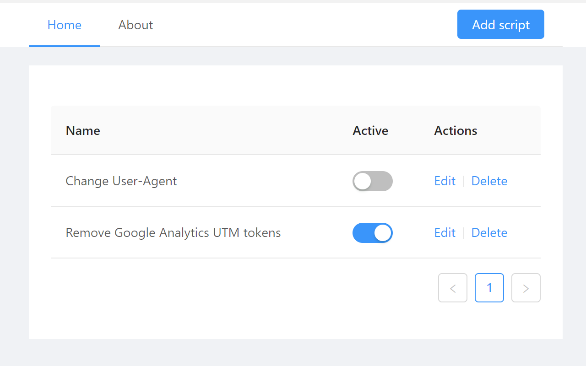
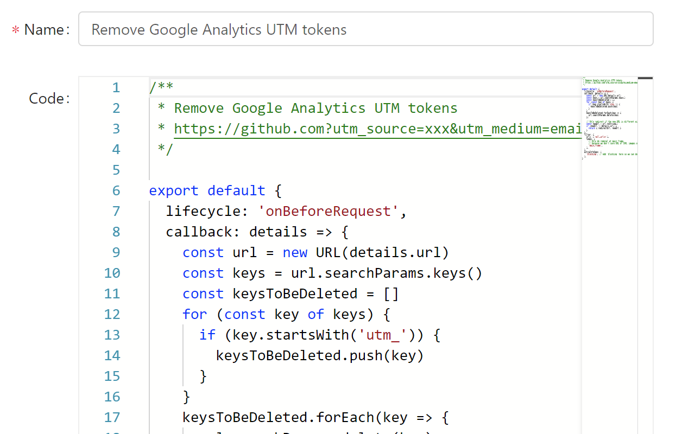
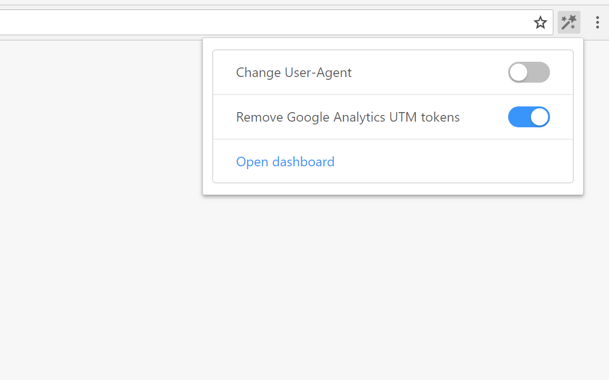

# Tampery

[](https://chrome.google.com/webstore/detail/tampery/bipnikifgdamlhpdkkmoaiokbgfkeapl)

Tampery is a browser extension to tamper browser requests in flight. It is **programmable**, which means you could write your own script to intercept, block, or modify browser requests. There is also a dashboard to manage all scripts.

  

## Installation

Install it from [Chrome Web Store](https://chrome.google.com/webstore/detail/tampery/bipnikifgdamlhpdkkmoaiokbgfkeapl)

## Examples

There are some simple examples to show how it works:

- [Change User-Agent](src/examples/change-user-agent.js)
- [Remove Google Analytics UTM tokens](src/examples/remove-google-analytics-utm-tokens.js)

## Usage

Tampery use `chrome.webRequest` API under the hood. Basically, every script should export an object as `default`, which has `lifecycle`, `callback`, `filter` and `extraInfoSpec` as keys. For example, if we want to change User-Agent in request headers, we could create a script as follows:

```js
const myUserAgent =
  'Mozilla/5.0 (iPhone; CPU iPhone OS 11_0 like Mac OS X) AppleWebKit/604.1.38 (KHTML, like Gecko) Version/11.0 Mobile/15A372 Safari/604.1'

export default {
  lifecycle: 'onBeforeSendHeaders',
  callback: ({ requestHeaders }) => {
    for (var i = 0; i < requestHeaders.length; ++i) {
      // Find the key named `User-Agent` and change its value
      if (requestHeaders[i].name.toLowerCase() === 'user-agent') {
        requestHeaders[i].value = myUserAgent
        break
      }
    }
    return { requestHeaders } // Return to change headers
  },
  filter: {
    urls: ['<all_urls>'], // Specify it takes effect on which URLs
  },
  extraInfoSpec: [
    'requestHeaders',
    'blocking', // Add `blocking` here since we want to change request headers
  ],
}
```

For more information, see documentation of `webRequest` API of [Chrome](https://developer.chrome.com/extensions/webRequest) and [Firefox](https://developer.mozilla.org/en-US/Add-ons/WebExtensions/API/webRequest)

## License

MIT
